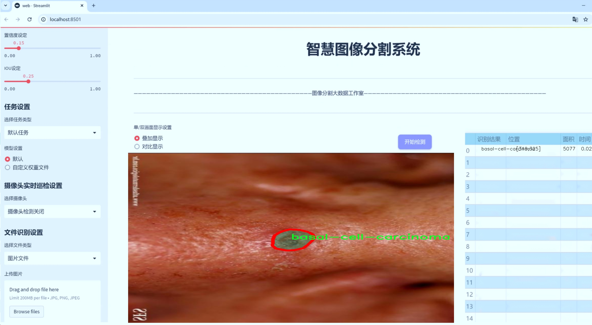
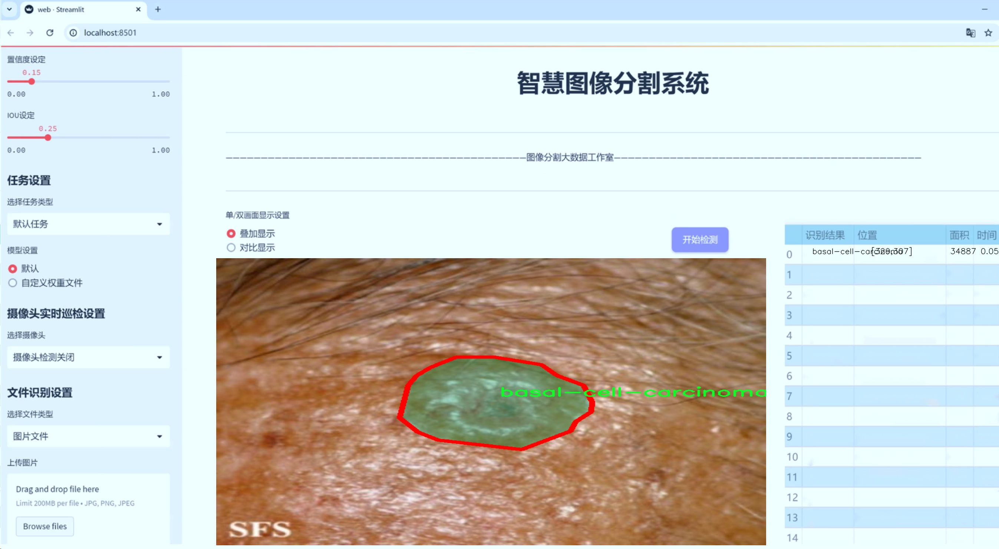
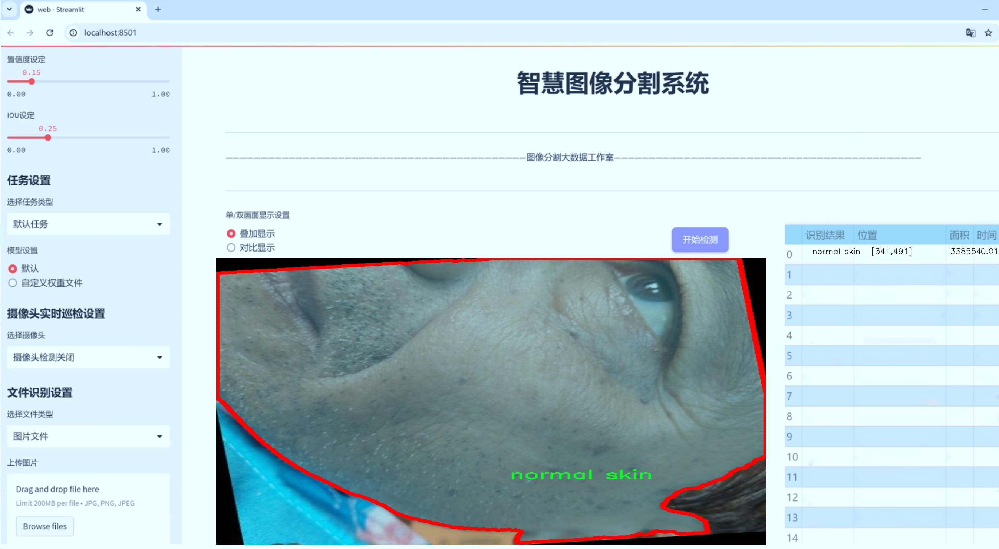
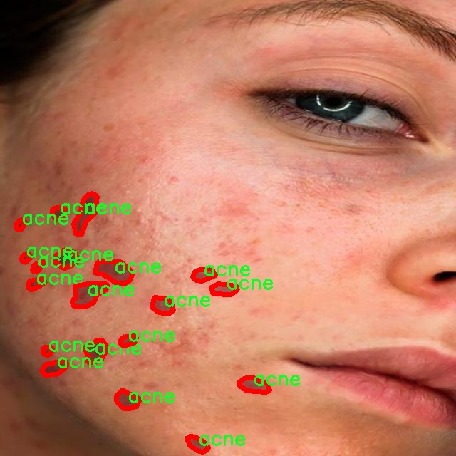
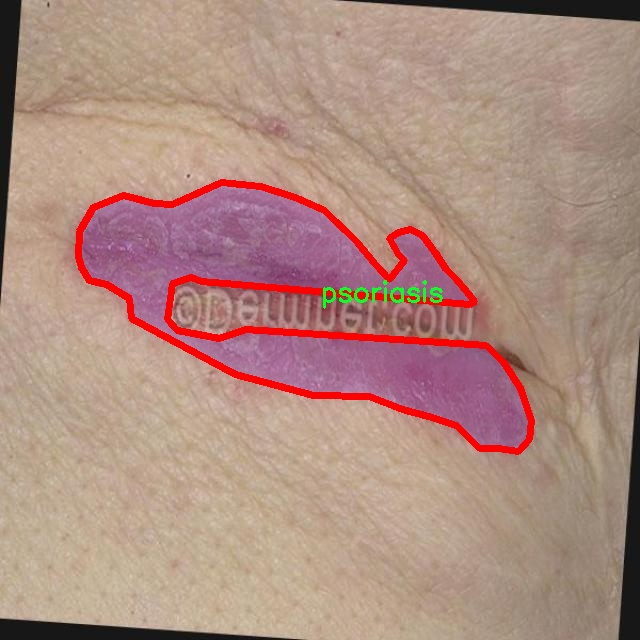
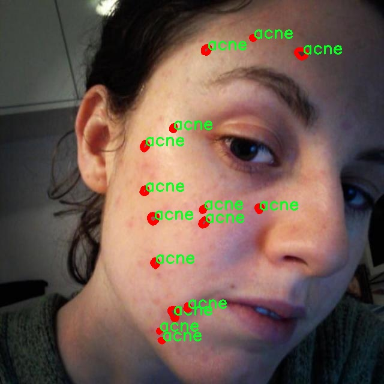
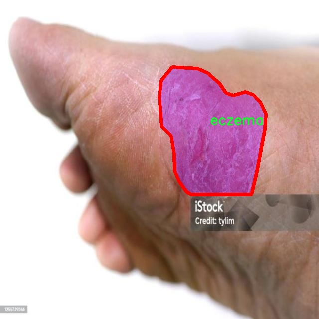
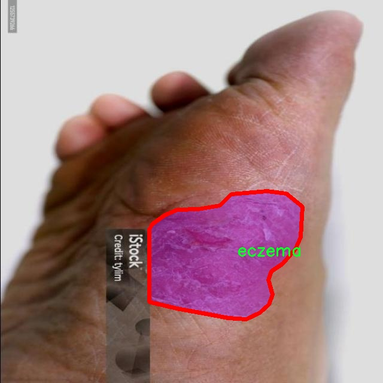

# 皮肤病变分割系统源码＆数据集分享
 [yolov8-seg-HGNetV2＆yolov8-seg-RepHGNetV2等50+全套改进创新点发刊_一键训练教程_Web前端展示]

### 1.研究背景与意义

项目参考[ILSVRC ImageNet Large Scale Visual Recognition Challenge](https://gitee.com/YOLOv8_YOLOv11_Segmentation_Studio/projects)

项目来源[AAAI Global Al lnnovation Contest](https://kdocs.cn/l/cszuIiCKVNis)

研究背景与意义

随着全球皮肤病发病率的逐年上升，皮肤病的早期诊断与治疗显得尤为重要。皮肤病不仅影响患者的外观和生活质量，还可能导致严重的心理负担和社会适应问题。因此，开发高效、准确的皮肤病变分割系统，对促进皮肤病的早期发现和及时治疗具有重要的现实意义。近年来，深度学习技术在医学图像处理领域取得了显著进展，尤其是目标检测和分割任务中，YOLO（You Only Look Once）系列模型因其高效性和准确性受到广泛关注。YOLOv8作为该系列的最新版本，结合了更为先进的网络结构和优化算法，具备了更强的特征提取能力和实时处理能力，为皮肤病变的自动化识别和分割提供了新的可能性。

本研究基于改进的YOLOv8模型，构建一个针对皮肤病变的分割系统，旨在实现对多种皮肤病变的精准识别与分割。所使用的数据集包含9300幅图像，涵盖19种不同类型的皮肤病，包括痤疮、基底细胞癌、湿疹、牛皮癣等。这些数据的多样性和丰富性为模型的训练提供了坚实的基础，使其能够在不同类型的皮肤病变中表现出良好的适应性和准确性。此外，数据集中还包含正常皮肤样本，为模型提供了良好的对比基础，有助于提高分割的精度和鲁棒性。

在当前的医学影像分析中，传统的人工诊断方法往往依赖于医生的经验，容易受到主观因素的影响，且在处理大量病例时效率较低。通过引入基于YOLOv8的自动化分割系统，可以有效降低人工诊断的工作负担，提高诊断的效率和准确性。同时，该系统的应用不仅限于临床诊断，还可以为皮肤病的研究提供数据支持，帮助科研人员深入分析不同皮肤病变的特征和发展规律，从而推动相关领域的研究进展。

此外，随着计算机视觉技术的不断发展，基于深度学习的图像分割方法在医疗领域的应用前景广阔。通过对YOLOv8模型的改进和优化，本研究将为皮肤病变的自动化分割提供新的思路和方法，推动医学影像分析技术的进步。同时，该研究也为后续的皮肤病智能诊断系统的开发奠定了基础，具有重要的学术价值和应用前景。

综上所述，基于改进YOLOv8的皮肤病变分割系统的研究，不仅具有重要的理论意义，也在实际应用中展现出广泛的前景。通过该系统的构建与应用，将为皮肤病的早期诊断和治疗提供有效的技术支持，推动医学影像分析领域的发展，最终惠及广大患者。

### 2.图片演示







##### 注意：由于此博客编辑较早，上面“2.图片演示”和“3.视频演示”展示的系统图片或者视频可能为老版本，新版本在老版本的基础上升级如下：（实际效果以升级的新版本为准）

  （1）适配了YOLOV8的“目标检测”模型和“实例分割”模型，通过加载相应的权重（.pt）文件即可自适应加载模型。

  （2）支持“图片识别”、“视频识别”、“摄像头实时识别”三种识别模式。

  （3）支持“图片识别”、“视频识别”、“摄像头实时识别”三种识别结果保存导出，解决手动导出（容易卡顿出现爆内存）存在的问题，识别完自动保存结果并导出到tempDir中。

  （4）支持Web前端系统中的标题、背景图等自定义修改，后面提供修改教程。

  另外本项目提供训练的数据集和训练教程,暂不提供权重文件（best.pt）,需要您按照教程进行训练后实现图片演示和Web前端界面演示的效果。

### 3.视频演示

[3.1 视频演示](https://www.bilibili.com/video/BV1nF22YpEaG/)

### 4.数据集信息展示

##### 4.1 本项目数据集详细数据（类别数＆类别名）

nc: 19
names: ['acne', 'basal-cell-carcinoma', 'darier-disease', 'eczema', 'epidermolysis-bullosa-pruriginosa', 'haiely-haiely-disease', 'hemanigome', 'impetigo', 'leishmanios', 'lichen-planus', 'lupussus-chronicus-discoides-erythemato', 'melanoma', 'molluscum-contagiosum', 'nevus', 'normal skin', 'poroktoriasis', 'psoriasis', 'tinea-corporis', 'tungiasis']


##### 4.2 本项目数据集信息介绍

数据集信息展示

在现代医学影像分析领域，尤其是在皮肤病变的自动化检测与分割中，数据集的质量和多样性直接影响到模型的性能和应用效果。本研究所采用的数据集“dataset801010”专门针对皮肤病变的图像分割任务，旨在通过改进YOLOv8-seg模型，提升对多种皮肤病变的识别与分割能力。该数据集包含19个不同的类别，涵盖了从常见皮肤病到较为罕见的皮肤病变，具有较高的临床价值和研究意义。

具体而言，数据集中的类别包括：痤疮（acne）、基底细胞癌（basal-cell-carcinoma）、达利尔病（darier-disease）、湿疹（eczema）、大疱性表皮松解症（epidermolysis-bullosa-pruriginosa）、哈利-哈利病（hailey-hailey-disease）、血管瘤（hemanigome）、脓疱病（impetigo）、利什曼病（leishmanios）、扁平苔藓（lichen-planus）、慢性盘状红斑狼疮（lupussus-chronicus-discoides-erythemato）、黑色素瘤（melanoma）、传染性软疣（molluscum-contagiosum）、痣（nevus）、正常皮肤（normal skin）、角化病（poroktoriasis）、银屑病（psoriasis）、体癣（tinea-corporis）以及钉虫病（tungiasis）。这些类别的选择不仅考虑到了疾病的流行程度，还涵盖了不同病理特征的皮肤病变，为模型的训练提供了丰富的样本。

“dataset801010”在数据采集过程中，严格遵循医学伦理规范，确保所有图像均来源于经过授权的临床案例。每个类别的样本均经过专业皮肤科医生的标注，确保了数据的准确性和可靠性。数据集中包含的图像具有多样的拍摄角度、光照条件和皮肤类型，极大地增强了模型的泛化能力。这种多样性使得模型在面对不同患者的皮肤病变时，能够更好地适应和识别。

在数据预处理阶段，所有图像均经过标准化处理，以保证输入数据的一致性。同时，为了增强模型的鲁棒性，数据集中还包含了一定比例的图像噪声和变形处理，模拟真实世界中可能遇到的各种情况。这种数据增强策略不仅提高了模型的训练效率，还有效降低了过拟合的风险。

通过对“dataset801010”的深入分析与应用，我们期望能够显著提升YOLOv8-seg在皮肤病变分割任务中的表现。这一数据集的构建和应用，标志着皮肤病变自动化检测技术的进一步发展，推动了医学影像分析领域的研究进程。未来，我们希望能够将这一技术推广至临床实践中，为皮肤病患者提供更为精准和高效的诊断支持，最终实现智能医疗的愿景。











### 5.全套项目环境部署视频教程（零基础手把手教学）

[5.1 环境部署教程链接（零基础手把手教学）](https://www.bilibili.com/video/BV1jG4Ve4E9t/?vd_source=bc9aec86d164b67a7004b996143742dc)


[5.2 安装Python虚拟环境创建和依赖库安装视频教程链接（零基础手把手教学）](https://www.bilibili.com/video/BV1nA4VeYEze/?vd_source=bc9aec86d164b67a7004b996143742dc)

### 6.手把手YOLOV8-seg训练视频教程（零基础小白有手就能学会）

[6.1 手把手YOLOV8-seg训练视频教程（零基础小白有手就能学会）](https://www.bilibili.com/video/BV1cA4VeYETe/?vd_source=bc9aec86d164b67a7004b996143742dc)


按照上面的训练视频教程链接加载项目提供的数据集，运行train.py即可开始训练



     Epoch   gpu_mem       box       obj       cls    labels  img_size
     1/200     0G   0.01576   0.01955  0.007536        22      1280: 100%|██████████| 849/849 [14:42<00:00,  1.04s/it]
               Class     Images     Labels          P          R     mAP@.5 mAP@.5:.95: 100%|██████████| 213/213 [01:14<00:00,  2.87it/s]
                 all       3395      17314      0.994      0.957      0.0957      0.0843

     Epoch   gpu_mem       box       obj       cls    labels  img_size
     2/200     0G   0.01578   0.01923  0.007006        22      1280: 100%|██████████| 849/849 [14:44<00:00,  1.04s/it]
               Class     Images     Labels          P          R     mAP@.5 mAP@.5:.95: 100%|██████████| 213/213 [01:12<00:00,  2.95it/s]
                 all       3395      17314      0.996      0.956      0.0957      0.0845

     Epoch   gpu_mem       box       obj       cls    labels  img_size
     3/200     0G   0.01561    0.0191  0.006895        27      1280: 100%|██████████| 849/849 [10:56<00:00,  1.29it/s]
               Class     Images     Labels          P          R     mAP@.5 mAP@.5:.95: 100%|███████   | 187/213 [00:52<00:00,  4.04it/s]
                 all       3395      17314      0.996      0.957      0.0957      0.0845


### 7.50+种全套YOLOV8-seg创新点代码加载调参视频教程（一键加载写好的改进模型的配置文件）

[7.1 50+种全套YOLOV8-seg创新点代码加载调参视频教程（一键加载写好的改进模型的配置文件）](https://www.bilibili.com/video/BV1Hw4VePEXv/?vd_source=bc9aec86d164b67a7004b996143742dc)

### 8.YOLOV8-seg图像分割算法原理

原始YOLOv8-seg算法原理

YOLOv8-seg作为YOLO系列模型的最新版本，继承并发展了前几代模型的核心思想，特别是在目标检测和分割任务中的应用。该算法的设计理念是实现高效、准确的目标检测与分割，适应多种复杂场景，尤其是在实时处理需求日益增长的背景下，YOLOv8-seg展现了其独特的优势。

YOLOv8-seg的架构主要由三个核心部分组成：Backbone、Neck和Head。这一结构设计不仅保证了特征提取的高效性，还为后续的目标检测和分割提供了强有力的支持。Backbone部分采用了CSPDarknet结构，这是一种创新的特征提取网络，旨在通过交叉阶段部分连接的方式来提高信息流动性和梯度传播效率。CSPDarknet将输入特征图分为两个分支，每个分支通过卷积层进行处理，这种设计使得网络能够捕捉到更丰富的特征信息，同时减少了计算量。

在Backbone中，C2f模块的引入是一个显著的改进。C2f模块通过将特征图分为两个分支并分别进行降维处理，能够有效地增强特征的表达能力。与传统的C3模块相比，C2f模块不仅提高了特征图的维度，还通过堆叠多个v8_C2fBottleneck层，进一步丰富了特征的多样性。这种结构的优势在于，它能够更好地捕捉到图像中的细节信息，为后续的目标检测和分割提供了坚实的基础。

Neck部分则负责多尺度特征的融合，采用了特征金字塔网络（FPN）和路径聚合网络（PAN）的组合结构。这一部分的设计理念是通过对来自不同层次的特征图进行有效融合，以便更好地捕捉不同尺度目标的信息。FPN通过上采样和下采样的方式，将高层语义信息与低层细节信息结合起来，增强了模型对小目标的检测能力。而PAN则通过路径聚合的方式，进一步提升了特征的表达能力，确保模型在复杂场景下的鲁棒性。

在Head部分，YOLOv8-seg采用了无锚框（Anchor-Free）的检测方式，这一创新使得模型能够直接预测目标的中心点及其宽高比例，显著提高了检测的速度和准确度。传统的锚框方法在处理不同尺寸和形状的目标时常常面临局限，而YOLOv8-seg通过这种新的方式，简化了检测过程，减少了对先验知识的依赖，从而在多样化的应用场景中展现出更强的适应性。

YOLOv8-seg的另一个重要特性是其在目标分割任务中的应用。通过对特征图的进一步处理，YOLOv8-seg能够实现精确的实例分割。这一过程涉及到对每个检测到的目标进行像素级的分类，从而实现对目标的精细化识别。为此，YOLOv8-seg在Head部分增加了分割头，通过对特征图的细致处理，生成目标的分割掩码。这一特性使得YOLOv8-seg不仅能够完成目标检测任务，还能够在复杂的场景中实现目标的精确分割，满足更高的应用需求。

在实际应用中，YOLOv8-seg展现出了卓越的性能。例如，在农业领域，该算法能够有效识别和定位苹果等水果，为自动采摘机器人提供实时的视觉反馈。通过结合蚁群算法进行路径规划，YOLOv8-seg不仅提升了目标检测的准确性，还优化了采摘机器人的工作效率。这一应用实例充分体现了YOLOv8-seg在实际场景中的广泛适用性和高效性。

综上所述，YOLOv8-seg算法通过引入先进的网络结构和创新的特征处理方式，实现了目标检测与分割的高效融合。其在Backbone、Neck和Head部分的设计，不仅提升了模型的性能，还为未来的研究和应用提供了新的思路。随着YOLOv8-seg的不断发展和完善，预计将在更多领域中发挥重要作用，推动目标检测与分割技术的进步。


### 9.系统功能展示（检测对象为举例，实际内容以本项目数据集为准）

图9.1.系统支持检测结果表格显示

  图9.2.系统支持置信度和IOU阈值手动调节

  图9.3.系统支持自定义加载权重文件best.pt(需要你通过步骤5中训练获得)

  图9.4.系统支持摄像头实时识别

  图9.5.系统支持图片识别

  图9.6.系统支持视频识别

  图9.7.系统支持识别结果文件自动保存

  图9.8.系统支持Excel导出检测结果数据


### 10.50+种全套YOLOV8-seg创新点原理讲解（非科班也可以轻松写刊发刊，V11版本正在科研待更新）

#### 10.1 由于篇幅限制，每个创新点的具体原理讲解就不一一展开，具体见下列网址中的创新点对应子项目的技术原理博客网址【Blog】：


[10.1 50+种全套YOLOV8-seg创新点原理讲解链接](https://gitee.com/qunmasj/good)

#### 10.2 部分改进模块原理讲解(完整的改进原理见上图和技术博客链接)【如果此小节的图加载失败可以通过CSDN或者Github搜索该博客的标题访问原始博客，原始博客图片显示正常】

### YOLOv8简介
YoloV8模型结构
YOLOv3之前的所有YOLO对象检测模型都是用C语言编写的，并使用了Darknet框架，Ultralytics发布了第一个使用PyTorch框架实现的YOLO (YOLOv3)；YOLOv3之后，Ultralytics发布了YOLOv5，在2023年1月，Ultralytics发布了YOLOv8，包含五个模型，用于检测、分割和分类。 YOLOv8 Nano是其中最快和最小的，而YOLOv8 Extra Large (YOLOv8x)是其中最准确但最慢的，具体模型见后续的图。

YOLOv8附带以下预训练模型:

目标检测在图像分辨率为640的COCO检测数据集上进行训练。
实例分割在图像分辨率为640的COCO分割数据集上训练。
图像分类模型在ImageNet数据集上预训练，图像分辨率为224。
YOLOv8 概述
具体到 YOLOv8 算法，其核心特性和改动可以归结为如下：

提供了一个全新的SOTA模型（state-of-the-art model），包括 P5 640 和 P6 1280 分辨率的目标检测网络和基于YOLACT的实例分割模型。和 YOLOv5 一样，基于缩放系数也提供了 N/S/M/L/X 尺度的不同大小模型，用于满足不同场景需求
骨干网络和 Neck 部分可能参考了 YOLOv7 ELAN 设计思想，将 YOLOv5 的 C3 结构换成了梯度流更丰富的 C2f 结构，并对不同尺度模型调整了不同的通道数，属于对模型结构精心微调，不再是一套参数应用所有模型，大幅提升了模型性能。
Head 部分相比 YOLOv5 改动较大，换成了目前主流的解耦头结构，将分类和检测头分离，同时也从Anchor-Based 换成了 Anchor-Free
Loss 计算方面采用了TaskAlignedAssigner正样本分配策略，并引入了Distribution Focal Loss
训练的数据增强部分引入了 YOLOX 中的最后 10 epoch 关闭 Mosiac 增强的操作，可以有效地提升精度


### HRNet V2简介
现在设计高低分辨率融合的思路主要有以下四种：


（a）对称结构。如U-Net、Hourglass等，都是先下采样再上采样，上下采样过程对称。

（b）级联金字塔。如refinenet等，高低分辨率融合时经过卷积处理。

（c）简单的baseline，用转职卷积进行上采样。

（d）扩张卷积。如deeplab等，增大感受野，减少下采样次数，可以无需跳层连接直接进行上采样。

（b）（c）都是使用复杂一些的网络进行下采样（如resnet、vgg），再用轻量级的网络进行上采样。

HRNet V1是在（b）的基础上进行改进，从头到尾保持大的分辨率表示。然而HRNet V1仅是用在姿态估计领域的，HRNet V2对它做小小的改进可以使其适用于更广的视觉任务。这一改进仅仅增加了较小的计算开销，但却提升了较大的准确度。

#### 网络结构图：


这个结构图简洁明了就不多介绍了，首先图2的输入是已经经过下采样四倍的feature map，横向的conv block指的是basicblock 或 bottleblock，不同分辨率之间的多交叉线部分是multi-resolution convolution（多分辨率组卷积）。

到此为止HRNet V2和HRNet V1是完全一致的。

区别之处在于这个基网络上加的一个head：


图3介绍的是接在图2最后的head。（a）是HRNet V1的头，很明显他只用了大分辨率的特征图。（b）（c）是HRNet V2的创新点，（b）用与语义分割，（c）用于目标检测。除此之外作者还在实验部分介绍了用于分类的head，如图4所示。


#### 多分辨率block：


一个多分辨率block由多分辨率组卷积（a）和多分辨率卷积（b）组成。（c）是一个正常卷积的展开，（b）的灵感来源于（c）。代码中（a）部分由Bottleneck和BasicBlock组成。

多分辨率卷积和正常卷积的区别：（1）多分辨率卷积中，每个通道的subset的分辨率都不一样。（2）通道之间的连接如果是降分辨率，则用的是3x3的2stride的卷积，如果是升分辨率，用的是双线性最邻近插值上采样。


### 11.项目核心源码讲解（再也不用担心看不懂代码逻辑）

#### 11.1 ui.py

以下是经过简化和注释的核心代码部分：

```python
import sys
import subprocess
from QtFusion.path import abs_path

def run_script(script_path):
    """
    使用当前 Python 环境运行指定的脚本。

    Args:
        script_path (str): 要运行的脚本路径
    """
    # 获取当前 Python 解释器的路径
    python_path = sys.executable

    # 构建运行命令，使用 streamlit 运行指定的脚本
    command = f'"{python_path}" -m streamlit run "{script_path}"'

    # 执行命令，并等待其完成
    result = subprocess.run(command, shell=True)
    
    # 检查命令执行结果，如果返回码不为0，表示出错
    if result.returncode != 0:
        print("脚本运行出错。")

# 主程序入口
if __name__ == "__main__":
    # 获取脚本的绝对路径
    script_path = abs_path("web.py")

    # 运行指定的脚本
    run_script(script_path)
```

### 代码分析与注释：
1. **导入模块**：
   - `sys`：用于访问与 Python 解释器相关的变量和函数。
   - `subprocess`：用于创建新进程、连接到它们的输入/输出/错误管道，并获取它们的返回码。
   - `abs_path`：从 `QtFusion.path` 模块导入的函数，用于获取文件的绝对路径。

2. **`run_script` 函数**：
   - **参数**：接收一个字符串参数 `script_path`，表示要运行的 Python 脚本的路径。
   - **功能**：构建并执行一个命令来运行指定的脚本。
   - **实现细节**：
     - 使用 `sys.executable` 获取当前 Python 解释器的路径。
     - 构建一个命令字符串，使用 `streamlit` 模块运行指定的脚本。
     - 使用 `subprocess.run` 执行命令，并检查返回码以判断脚本是否成功运行。

3. **主程序入口**：
   - 使用 `if __name__ == "__main__":` 确保只有在直接运行该脚本时才会执行以下代码。
   - 调用 `abs_path` 函数获取 `web.py` 的绝对路径。
   - 调用 `run_script` 函数运行指定的脚本。

这个程序文件 `ui.py` 是一个用于运行指定 Python 脚本的简单工具，主要通过调用 `subprocess` 模块来执行外部命令。文件的开头部分导入了必要的模块，包括 `sys`、`os` 和 `subprocess`，以及一个自定义的路径处理函数 `abs_path`，这个函数来自于 `QtFusion.path` 模块，可能用于获取文件的绝对路径。

在文件中定义了一个名为 `run_script` 的函数，该函数接受一个参数 `script_path`，表示要运行的脚本的路径。函数内部首先获取当前 Python 解释器的路径，这通过 `sys.executable` 实现。接着，构建一个命令字符串，使用 `streamlit` 来运行指定的脚本。这里使用了 `-m` 参数来指定模块运行方式，并且将脚本路径用引号括起来，以防路径中包含空格。

然后，使用 `subprocess.run` 方法执行构建好的命令。这个方法会在新的 shell 中运行命令，并等待其完成。执行后，检查返回的结果代码，如果返回代码不为零，表示脚本运行出错，此时会打印出一条错误信息。

在文件的最后部分，使用 `if __name__ == "__main__":` 语句来确保只有在直接运行该脚本时才会执行后面的代码。这里指定了要运行的脚本路径为 `web.py`，并调用 `run_script` 函数来执行这个脚本。

总的来说，这个程序的主要功能是提供一个接口，通过命令行运行一个指定的 Python 脚本，并处理可能出现的错误。

#### 11.2 ultralytics\nn\extra_modules\afpn.py

以下是保留的核心代码部分，并附上详细的中文注释：

```python
import torch
import torch.nn as nn
import torch.nn.functional as F
from ..modules.conv import Conv

class BasicBlock(nn.Module):
    """基本的残差块，包含两个卷积层"""
    def __init__(self, filter_in, filter_out):
        super(BasicBlock, self).__init__()
        # 第一个卷积层，使用3x3卷积
        self.conv1 = Conv(filter_in, filter_out, 3)
        # 第二个卷积层，使用3x3卷积，不使用激活函数
        self.conv2 = Conv(filter_out, filter_out, 3, act=False)

    def forward(self, x):
        residual = x  # 保存输入以便后续加回去
        out = self.conv1(x)  # 通过第一个卷积层
        out = self.conv2(out)  # 通过第二个卷积层
        out += residual  # 加上输入的残差
        return self.conv1.act(out)  # 返回经过激活函数处理的输出


class Upsample(nn.Module):
    """上采样模块，将输入特征图的尺寸扩大"""
    def __init__(self, in_channels, out_channels, scale_factor=2):
        super(Upsample, self).__init__()
        # 定义上采样的卷积层和上采样操作
        self.upsample = nn.Sequential(
            Conv(in_channels, out_channels, 1),  # 1x1卷积
            nn.Upsample(scale_factor=scale_factor, mode='bilinear')  # 双线性插值上采样
        )

    def forward(self, x):
        return self.upsample(x)  # 直接返回上采样后的结果


class Downsample_x2(nn.Module):
    """下采样模块，将输入特征图的尺寸缩小一半"""
    def __init__(self, in_channels, out_channels):
        super(Downsample_x2, self).__init__()
        # 定义下采样的卷积层
        self.downsample = Conv(in_channels, out_channels, 2, 2, 0)  # 2x2卷积，步幅为2

    def forward(self, x):
        return self.downsample(x)  # 直接返回下采样后的结果


class ASFF_2(nn.Module):
    """自适应特征融合模块，融合两个输入特征图"""
    def __init__(self, inter_dim=512):
        super(ASFF_2, self).__init__()
        self.inter_dim = inter_dim
        compress_c = 8  # 压缩通道数

        # 定义权重计算的卷积层
        self.weight_level_1 = Conv(self.inter_dim, compress_c, 1)
        self.weight_level_2 = Conv(self.inter_dim, compress_c, 1)
        self.weight_levels = nn.Conv2d(compress_c * 2, 2, kernel_size=1, stride=1, padding=0)
        self.conv = Conv(self.inter_dim, self.inter_dim, 3)  # 最后的卷积层

    def forward(self, input1, input2):
        # 计算每个输入的权重
        level_1_weight_v = self.weight_level_1(input1)
        level_2_weight_v = self.weight_level_2(input2)

        # 合并权重并计算最终的权重
        levels_weight_v = torch.cat((level_1_weight_v, level_2_weight_v), 1)
        levels_weight = self.weight_levels(levels_weight_v)
        levels_weight = F.softmax(levels_weight, dim=1)  # 使用softmax归一化权重

        # 融合输入特征图
        fused_out_reduced = input1 * levels_weight[:, 0:1, :, :] + \
                            input2 * levels_weight[:, 1:2, :, :]

        out = self.conv(fused_out_reduced)  # 通过卷积层
        return out  # 返回融合后的结果


class BlockBody_P345(nn.Module):
    """特征块体，处理三个不同尺度的特征图"""
    def __init__(self, channels=[64, 128, 256, 512]):
        super(BlockBody_P345, self).__init__()

        # 定义不同尺度的卷积块
        self.blocks_scalezero1 = nn.Sequential(Conv(channels[0], channels[0], 1))
        self.blocks_scaleone1 = nn.Sequential(Conv(channels[1], channels[1], 1))
        self.blocks_scaletwo1 = nn.Sequential(Conv(channels[2], channels[2], 1))

        # 定义下采样和上采样模块
        self.downsample_scalezero1_2 = Downsample_x2(channels[0], channels[1])
        self.upsample_scaleone1_2 = Upsample(channels[1], channels[0], scale_factor=2)

        # 定义自适应特征融合模块
        self.asff_scalezero1 = ASFF_2(inter_dim=channels[0])
        self.asff_scaleone1 = ASFF_2(inter_dim=channels[1])

        # 定义多个BasicBlock以增加网络深度
        self.blocks_scalezero2 = nn.Sequential(
            BasicBlock(channels[0], channels[0]),
            BasicBlock(channels[0], channels[0]),
            BasicBlock(channels[0], channels[0]),
            BasicBlock(channels[0], channels[0]),
        )
        self.blocks_scaleone2 = nn.Sequential(
            BasicBlock(channels[1], channels[1]),
            BasicBlock(channels[1], channels[1]),
            BasicBlock(channels[1], channels[1]),
            BasicBlock(channels[1], channels[1]),
        )

    def forward(self, x):
        x0, x1, x2 = x  # 分别获取三个尺度的输入

        # 处理每个尺度的特征图
        x0 = self.blocks_scalezero1(x0)
        x1 = self.blocks_scaleone1(x1)
        x2 = self.blocks_scaletwo1(x2)

        # 进行特征融合
        scalezero = self.asff_scalezero1(x0, self.upsample_scaleone1_2(x1))
        scaleone = self.asff_scaleone1(self.downsample_scalezero1_2(x0), x1)

        # 继续处理融合后的特征图
        x0 = self.blocks_scalezero2(scalezero)
        x1 = self.blocks_scaleone2(scaleone)

        return x0, x1, x2  # 返回处理后的特征图


class AFPN_P345(nn.Module):
    """自适应特征金字塔网络，处理三个尺度的输入特征图"""
    def __init__(self, in_channels=[256, 512, 1024], out_channels=256, factor=4):
        super(AFPN_P345, self).__init__()

        # 定义输入特征图的卷积层
        self.conv0 = Conv(in_channels[0], in_channels[0] // factor, 1)
        self.conv1 = Conv(in_channels[1], in_channels[1] // factor, 1)
        self.conv2 = Conv(in_channels[2], in_channels[2] // factor, 1)

        # 定义特征块体
        self.body = BlockBody_P345([in_channels[0] // factor, in_channels[1] // factor, in_channels[2] // factor])

        # 定义输出特征图的卷积层
        self.conv00 = Conv(in_channels[0] // factor, out_channels, 1)
        self.conv11 = Conv(in_channels[1] // factor, out_channels, 1)
        self.conv22 = Conv(in_channels[2] // factor, out_channels, 1)

    def forward(self, x):
        x0, x1, x2 = x  # 获取三个尺度的输入特征图

        # 通过卷积层处理输入特征图
        x0 = self.conv0(x0)
        x1 = self.conv1(x1)
        x2 = self.conv2(x2)

        # 通过特征块体处理特征图
        out0, out1, out2 = self.body([x0, x1, x2])

        # 通过输出卷积层处理特征图
        out0 = self.conv00(out0)
        out1 = self.conv11(out1)
        out2 = self.conv22(out2)

        return [out0, out1, out2]  # 返回处理后的特征图
```

### 代码核心部分说明：
1. **BasicBlock**: 这是一个基本的残差块，包含两个卷积层，能够有效地进行特征提取并保留输入信息。
2. **Upsample 和 Downsample**: 这两个模块用于特征图的上采样和下采样，分别扩大和缩小特征图的尺寸。
3. **ASFF_2**: 自适应特征融合模块，能够融合两个输入特征图，计算每个特征图的权重并进行加权融合。
4. **BlockBody_P345**: 处理三个不同尺度特征图的模块，包含多个卷积块和自适应特征融合模块。
5. **AFPN_P345**: 自适应特征金字塔网络的主要结构，负责处理输入特征图并生成输出特征图。

这个程序文件定义了一些用于构建特征金字塔网络（FPN）的模块，主要用于计算机视觉任务，特别是目标检测和分割。代码中包含多个类，每个类实现了不同的功能模块，以下是对这些模块的详细说明。

首先，文件引入了一些必要的库，包括`torch`和`torch.nn`，并从其他模块中导入了一些自定义的卷积和块结构。接着，定义了几个基本的神经网络模块，如`BasicBlock`、`Upsample`、`Downsample_x2`、`Downsample_x4`、`Downsample_x8`等。`BasicBlock`类实现了一个基本的残差块，包含两个卷积层，并通过残差连接将输入与输出相加。`Upsample`和`Downsample`类则分别实现了上采样和下采样操作，利用卷积和插值方法改变特征图的尺寸。

接下来，`ASFF_2`、`ASFF_3`和`ASFF_4`类实现了自适应特征融合模块（ASFF），用于融合不同尺度的特征图。每个ASFF模块通过计算输入特征图的权重并进行加权求和来实现特征融合，权重是通过卷积层计算得到的，并使用softmax函数进行归一化。

`BlockBody_P345`和`BlockBody_P2345`类是特征金字塔的核心部分，分别处理三个和四个尺度的特征图。这些类包含多个卷积层、残差块和ASFF模块，通过下采样和上采样操作连接不同尺度的特征图，以便于在特征金字塔中进行信息的传递和融合。

`AFPN_P345`和`AFPN_P2345`类则是特征金字塔网络的具体实现，负责输入特征图的处理和输出特征图的生成。它们通过调用前面定义的模块，构建完整的特征金字塔结构，并在初始化时对卷积层的权重进行初始化。

最后，`BlockBody_P345_Custom`、`BlockBody_P2345_Custom`、`AFPN_P345_Custom`和`AFPN_P2345_Custom`类允许用户自定义块类型，以便于在特征金字塔中使用不同的网络结构，提供了更大的灵活性。

总体来说，这个程序文件通过模块化的设计实现了特征金字塔网络的构建，便于在目标检测和分割等任务中使用。每个模块都可以独立使用或替换，以适应不同的需求和实验。

#### 11.3 ultralytics\utils\__init__.py

以下是经过简化和注释的核心代码部分：

```python
import os
import platform
import logging
from pathlib import Path
import torch
import yaml

# 设置日志记录
def set_logging(name='ultralytics', verbose=True):
    """设置日志记录配置"""
    level = logging.INFO if verbose else logging.ERROR  # 根据是否详细设置日志级别
    logging.basicConfig(level=level, format='%(message)s')  # 配置日志格式

# 检查当前操作系统是否为Ubuntu
def is_ubuntu() -> bool:
    """检查操作系统是否为Ubuntu"""
    return platform.system() == 'Linux' and 'ubuntu' in platform.version().lower()

# 加载YAML文件
def yaml_load(file='data.yaml'):
    """从YAML文件加载数据"""
    with open(file, 'r', encoding='utf-8') as f:
        return yaml.safe_load(f)  # 使用安全加载避免执行任意代码

# 保存数据到YAML文件
def yaml_save(file='data.yaml', data=None):
    """将数据保存到YAML文件"""
    with open(file, 'w', encoding='utf-8') as f:
        yaml.safe_dump(data, f, sort_keys=False)  # 将数据写入文件

# 检查是否在线
def is_online() -> bool:
    """检查是否有互联网连接"""
    import socket
    try:
        socket.create_connection(("1.1.1.1", 80))  # 尝试连接公共DNS
        return True
    except OSError:
        return False

# 默认配置路径
DEFAULT_CFG_PATH = Path(__file__).resolve().parents[1] / 'cfg/default.yaml'

# 加载默认配置
DEFAULT_CFG_DICT = yaml_load(DEFAULT_CFG_PATH)  # 从默认配置文件加载配置
DEFAULT_CFG = {k: v for k, v in DEFAULT_CFG_DICT.items()}  # 将配置转换为字典

# 主程序入口
if __name__ == "__main__":
    set_logging()  # 设置日志
    if is_ubuntu():
        print("当前操作系统是Ubuntu")
    if is_online():
        print("当前在线")
    else:
        print("当前离线")
```

### 代码注释说明：

1. **日志设置**：`set_logging` 函数用于配置日志记录的名称和级别，便于调试和信息输出。
2. **操作系统检查**：`is_ubuntu` 函数用于判断当前操作系统是否为Ubuntu，返回布尔值。
3. **YAML文件操作**：`yaml_load` 和 `yaml_save` 函数分别用于从YAML文件加载数据和将数据保存到YAML文件，确保数据的持久化。
4. **在线检查**：`is_online` 函数通过尝试连接公共DNS来检查当前是否有互联网连接。
5. **默认配置加载**：从指定路径加载默认配置文件，并将其转换为字典形式，方便后续使用。
6. **主程序入口**：通过 `if __name__ == "__main__":` 语句确保只有在直接运行该脚本时才会执行相关代码，进行日志设置和状态检查。

这个程序文件是Ultralytics YOLO（You Only Look Once）框架的一个工具模块，主要用于设置和管理与YOLO模型相关的各种功能和配置。文件中包含了许多导入的库和定义的函数、类，旨在提供便捷的工具以支持YOLO模型的训练、验证和推理等任务。

首先，文件导入了多种Python标准库和第三方库，包括`os`、`logging`、`torch`、`yaml`等。这些库提供了文件操作、日志记录、深度学习支持和YAML配置文件处理等功能。

接下来，文件定义了一些常量，例如多GPU训练的常量、文件路径、默认配置路径等。通过这些常量，程序能够灵活地处理不同的环境和配置。

文件中还定义了几个类，包括`TQDM`、`SimpleClass`和`IterableSimpleNamespace`。`TQDM`类是对进度条的自定义实现，提供了更灵活的参数设置；`SimpleClass`类则为其他类提供了更好的字符串表示和错误报告功能；`IterableSimpleNamespace`类扩展了`SimpleNamespace`，使其可以迭代并与字典配合使用。

此外，文件中还包含了一些用于设置和管理绘图参数的函数，例如`plt_settings`，以及用于日志记录的`set_logging`函数。日志记录功能通过设置不同的日志级别和格式来帮助开发者调试和监控程序运行状态。

文件还实现了一些与系统环境相关的检查函数，例如`is_ubuntu`、`is_colab`、`is_kaggle`等，这些函数用于判断当前代码运行的环境，以便进行相应的配置和处理。

在YAML文件的读写方面，文件提供了`yaml_save`、`yaml_load`和`yaml_print`等函数，用于将数据保存为YAML格式、从YAML文件加载数据以及以可读的格式打印YAML内容。

此外，文件还定义了一些用于处理多线程和异常的工具类，例如`ThreadingLocked`和`TryExcept`，这些类可以帮助确保代码在多线程环境下的安全执行，并提供异常处理的便利。

最后，文件中包含了一些与Git相关的函数，例如获取Git目录、获取Git远程URL和获取当前Git分支等，这些功能有助于在开发和版本控制过程中进行管理。

总的来说，这个文件为YOLO模型的使用提供了丰富的工具和功能，帮助用户更高效地进行模型训练和推理，同时也增强了代码的可读性和可维护性。

#### 11.4 ultralytics\models\yolo\detect\train.py

以下是代码中最核心的部分，并附上详细的中文注释：

```python
class DetectionTrainer(BaseTrainer):
    """
    DetectionTrainer类，继承自BaseTrainer类，用于基于检测模型的训练。
    """

    def build_dataset(self, img_path, mode='train', batch=None):
        """
        构建YOLO数据集。

        参数:
            img_path (str): 包含图像的文件夹路径。
            mode (str): 模式，'train'表示训练模式，'val'表示验证模式，用户可以为每种模式自定义不同的增强。
            batch (int, optional): 批次大小，仅用于'rect'模式。默认为None。
        """
        gs = max(int(de_parallel(self.model).stride.max() if self.model else 0), 32)  # 获取模型的最大步幅
        return build_yolo_dataset(self.args, img_path, batch, self.data, mode=mode, rect=mode == 'val', stride=gs)

    def get_dataloader(self, dataset_path, batch_size=16, rank=0, mode='train'):
        """构造并返回数据加载器。"""
        assert mode in ['train', 'val']  # 确保模式是'train'或'val'
        with torch_distributed_zero_first(rank):  # 如果使用分布式数据并行（DDP），只初始化一次数据集
            dataset = self.build_dataset(dataset_path, mode, batch_size)  # 构建数据集
        shuffle = mode == 'train'  # 训练模式下打乱数据
        if getattr(dataset, 'rect', False) and shuffle:
            LOGGER.warning("WARNING ⚠️ 'rect=True'与DataLoader的shuffle不兼容，设置shuffle=False")
            shuffle = False  # 如果'rect'为True，禁用打乱
        workers = self.args.workers if mode == 'train' else self.args.workers * 2  # 设置工作线程数
        return build_dataloader(dataset, batch_size, workers, shuffle, rank)  # 返回数据加载器

    def preprocess_batch(self, batch):
        """对一批图像进行预处理，包括缩放和转换为浮点数。"""
        batch['img'] = batch['img'].to(self.device, non_blocking=True).float() / 255  # 将图像转换为浮点数并归一化
        return batch

    def set_model_attributes(self):
        """设置模型的属性，包括类别数量和类别名称。"""
        self.model.nc = self.data['nc']  # 将类别数量附加到模型
        self.model.names = self.data['names']  # 将类别名称附加到模型
        self.model.args = self.args  # 将超参数附加到模型

    def get_model(self, cfg=None, weights=None, verbose=True):
        """返回一个YOLO检测模型。"""
        model = DetectionModel(cfg, nc=self.data['nc'], verbose=verbose)  # 创建检测模型
        if weights:
            model.load(weights)  # 加载权重
        return model

    def get_validator(self):
        """返回YOLO模型验证器。"""
        self.loss_names = 'box_loss', 'cls_loss', 'dfl_loss'  # 定义损失名称
        return yolo.detect.DetectionValidator(self.test_loader, save_dir=self.save_dir, args=copy(self.args))  # 返回验证器

    def label_loss_items(self, loss_items=None, prefix='train'):
        """
        返回带标签的训练损失项字典。

        对于分类不需要，但对于分割和检测是必要的。
        """
        keys = [f'{prefix}/{x}' for x in self.loss_names]  # 创建损失项的键
        if loss_items is not None:
            loss_items = [round(float(x), 5) for x in loss_items]  # 将张量转换为保留5位小数的浮点数
            return dict(zip(keys, loss_items))  # 返回损失项字典
        else:
            return keys  # 返回键列表

    def progress_string(self):
        """返回格式化的训练进度字符串，包括轮次、GPU内存、损失、实例和大小。"""
        return ('\n' + '%11s' *
                (4 + len(self.loss_names))) % ('Epoch', 'GPU_mem', *self.loss_names, 'Instances', 'Size')

    def plot_training_samples(self, batch, ni):
        """绘制带有注释的训练样本。"""
        plot_images(images=batch['img'],
                    batch_idx=batch['batch_idx'],
                    cls=batch['cls'].squeeze(-1),
                    bboxes=batch['bboxes'],
                    paths=batch['im_file'],
                    fname=self.save_dir / f'train_batch{ni}.jpg',
                    on_plot=self.on_plot)

    def plot_metrics(self):
        """从CSV文件中绘制指标。"""
        plot_results(file=self.csv, on_plot=self.on_plot)  # 保存结果图

    def plot_training_labels(self):
        """创建YOLO模型的标记训练图。"""
        boxes = np.concatenate([lb['bboxes'] for lb in self.train_loader.dataset.labels], 0)  # 合并所有边界框
        cls = np.concatenate([lb['cls'] for lb in self.train_loader.dataset.labels], 0)  # 合并所有类别
        plot_labels(boxes, cls.squeeze(), names=self.data['names'], save_dir=self.save_dir, on_plot=self.on_plot)  # 绘制标签
```

### 代码核心部分解释：
1. **DetectionTrainer类**：该类负责YOLO模型的训练，继承自基础训练类`BaseTrainer`。
2. **build_dataset方法**：构建YOLO数据集，支持训练和验证模式，允许用户自定义数据增强。
3. **get_dataloader方法**：构造数据加载器，支持分布式训练，并根据模式设置数据打乱。
4. **preprocess_batch方法**：对图像批次进行预处理，将图像转换为浮点数并归一化。
5. **set_model_attributes方法**：设置模型的类别数量和名称，确保模型正确配置。
6. **get_model方法**：返回YOLO检测模型，支持加载预训练权重。
7. **get_validator方法**：返回用于验证模型的验证器。
8. **label_loss_items方法**：返回带有标签的损失项字典，便于监控训练过程中的损失。
9. **plot_training_samples和plot_metrics方法**：用于可视化训练样本和训练指标，帮助分析模型性能。

这个程序文件是用于训练YOLO（You Only Look Once）目标检测模型的，属于Ultralytics库的一部分。文件中定义了一个名为`DetectionTrainer`的类，该类继承自`BaseTrainer`，并专门用于处理基于YOLO模型的训练任务。

在文件的开头，导入了一些必要的库和模块，包括数据处理、模型构建、训练器基类、YOLO模型、日志记录工具等。接下来，`DetectionTrainer`类的文档字符串提供了一个使用示例，展示了如何创建一个训练器实例并开始训练。

`DetectionTrainer`类中包含多个方法。`build_dataset`方法用于构建YOLO数据集，接受图像路径、模式（训练或验证）和批次大小作为参数。它会根据模型的步幅（stride）来确定数据集的构建方式。

`get_dataloader`方法用于构建并返回数据加载器。它会根据模式选择是否打乱数据，并设置工作线程的数量。使用`torch_distributed_zero_first`可以确保在分布式训练中只初始化一次数据集。

`preprocess_batch`方法用于对图像批次进行预处理，将图像转换为浮点数并缩放到[0, 1]的范围。

`set_model_attributes`方法用于设置模型的属性，包括类别数量和类别名称等。`get_model`方法返回一个YOLO检测模型，并可以加载预训练权重。

`get_validator`方法返回一个用于验证YOLO模型的验证器，包含损失名称的定义。`label_loss_items`方法用于返回带有标签的训练损失项字典，适用于分割和检测任务。

`progress_string`方法返回一个格式化的字符串，显示训练进度，包括当前的epoch、GPU内存使用情况、损失值、实例数量和图像大小等信息。

`plot_training_samples`方法用于绘制训练样本及其注释，方便可视化训练过程。`plot_metrics`和`plot_training_labels`方法则用于绘制训练过程中的指标和标签，分别从CSV文件中读取数据并生成相应的图像。

整体来看，这个文件提供了YOLO模型训练的完整流程，包括数据集构建、数据加载、模型设置、训练过程监控和结果可视化等功能。

#### 11.5 ultralytics\models\rtdetr\val.py

以下是代码中最核心的部分，并附上详细的中文注释：

```python
import torch
from ultralytics.data import YOLODataset
from ultralytics.models.yolo.detect import DetectionValidator
from ultralytics.utils import ops

class RTDETRDataset(YOLODataset):
    """
    RT-DETR数据集类，继承自YOLODataset类，专为实时检测和跟踪任务设计。
    """

    def __init__(self, *args, data=None, **kwargs):
        """初始化RTDETRDataset类，调用父类的初始化方法。"""
        super().__init__(*args, data=data, use_segments=False, use_keypoints=False, **kwargs)

    def load_image(self, i, rect_mode=False):
        """加载数据集中索引为'i'的图像，返回图像及其调整后的尺寸。"""
        return super().load_image(i=i, rect_mode=rect_mode)

    def build_transforms(self, hyp=None):
        """构建图像变换操作，主要用于评估阶段。"""
        if self.augment:
            # 根据是否进行增强设置mosaic和mixup的参数
            hyp.mosaic = hyp.mosaic if self.augment and not self.rect else 0.0
            hyp.mixup = hyp.mixup if self.augment and not self.rect else 0.0
            transforms = v8_transforms(self, self.imgsz, hyp, stretch=True)  # 构建变换
        else:
            transforms = Compose([])  # 不进行任何变换
        # 添加格式化操作
        transforms.append(
            Format(bbox_format='xywh',
                   normalize=True,
                   return_mask=self.use_segments,
                   return_keypoint=self.use_keypoints,
                   batch_idx=True,
                   mask_ratio=hyp.mask_ratio,
                   mask_overlap=hyp.overlap_mask))
        return transforms


class RTDETRValidator(DetectionValidator):
    """
    RTDETRValidator类，扩展自DetectionValidator类，提供专门针对RT-DETR模型的验证功能。
    """

    def build_dataset(self, img_path, mode='val', batch=None):
        """
        构建RTDETR数据集。

        Args:
            img_path (str): 包含图像的文件夹路径。
            mode (str): 模式，'train'或'val'，用户可以为每种模式自定义不同的增强。
            batch (int, optional): 批量大小，适用于'rect'模式。默认为None。
        """
        return RTDETRDataset(
            img_path=img_path,
            imgsz=self.args.imgsz,
            batch_size=batch,
            augment=False,  # 不进行增强
            hyp=self.args,
            rect=False,  # 不进行矩形调整
            cache=self.args.cache or None,
            prefix=colorstr(f'{mode}: '),
            data=self.data)

    def postprocess(self, preds):
        """对预测输出应用非极大值抑制（NMS）。"""
        bs, _, nd = preds[0].shape  # 获取批次大小、通道数和预测数量
        bboxes, scores = preds[0].split((4, nd - 4), dim=-1)  # 分离边界框和分数
        bboxes *= self.args.imgsz  # 将边界框缩放到原始图像大小
        outputs = [torch.zeros((0, 6), device=bboxes.device)] * bs  # 初始化输出
        for i, bbox in enumerate(bboxes):  # 遍历每个边界框
            bbox = ops.xywh2xyxy(bbox)  # 转换边界框格式
            score, cls = scores[i].max(-1)  # 获取最大分数和对应的类别
            pred = torch.cat([bbox, score[..., None], cls[..., None]], dim=-1)  # 合并边界框、分数和类别
            pred = pred[score.argsort(descending=True)]  # 按分数排序
            outputs[i] = pred  # 保存结果

        return outputs

    def update_metrics(self, preds, batch):
        """更新评估指标。"""
        for si, pred in enumerate(preds):
            idx = batch['batch_idx'] == si  # 获取当前批次的索引
            cls = batch['cls'][idx]  # 获取真实类别
            bbox = batch['bboxes'][idx]  # 获取真实边界框
            nl, npr = cls.shape[0], pred.shape[0]  # 标签数量和预测数量
            shape = batch['ori_shape'][si]  # 原始图像的形状
            correct_bboxes = torch.zeros(npr, self.niou, dtype=torch.bool, device=self.device)  # 初始化正确边界框
            self.seen += 1  # 增加已处理的样本数量

            if npr == 0:  # 如果没有预测
                if nl:
                    self.stats.append((correct_bboxes, *torch.zeros((2, 0), device=self.device), cls.squeeze(-1)))
                continue

            # 处理预测
            if self.args.single_cls:
                pred[:, 5] = 0  # 如果是单类，设置类别为0
            predn = pred.clone()  # 克隆预测
            predn[..., [0, 2]] *= shape[1] / self.args.imgsz  # 转换到原始空间
            predn[..., [1, 3]] *= shape[0] / self.args.imgsz  # 转换到原始空间

            # 评估
            if nl:
                tbox = ops.xywh2xyxy(bbox)  # 转换真实边界框格式
                tbox[..., [0, 2]] *= shape[1]  # 转换到原始空间
                tbox[..., [1, 3]] *= shape[0]  # 转换到原始空间
                labelsn = torch.cat((cls, tbox), 1)  # 合并真实标签和边界框
                correct_bboxes = self._process_batch(predn.float(), labelsn)  # 处理批次以更新指标
            self.stats.append((correct_bboxes, pred[:, 4], pred[:, 5], cls.squeeze(-1)))  # 更新统计信息
```

### 代码核心部分说明：
1. **RTDETRDataset类**：继承自YOLODataset，主要用于加载和处理RT-DETR模型的数据集。
   - `load_image`方法用于加载图像。
   - `build_transforms`方法用于构建图像变换操作。

2. **RTDETRValidator类**：继承自DetectionValidator，提供RT-DETR模型的验证功能。
   - `build_dataset`方法用于构建数据集。
   - `postprocess`方法应用非极大值抑制（NMS）来处理预测结果。
   - `update_metrics`方法用于更新评估指标，包括处理预测和真实标签的比较。

这个程序文件 `val.py` 是用于实现 RT-DETR（实时目标检测与跟踪）模型的验证功能。它继承了 Ultralytics YOLO 框架的基础结构，主要包括数据集的构建、模型的验证和后处理等功能。

首先，文件导入了一些必要的库和模块，包括路径处理、PyTorch、YOLO 数据集、数据增强方法、检测验证器等。然后定义了两个主要的类：`RTDETRDataset` 和 `RTDETRValidator`。

`RTDETRDataset` 类是一个专门为 RT-DETR 模型设计的数据集类，继承自 YOLODataset。它的构造函数调用了父类的构造函数，并设置了一些参数。该类重写了 `load_image` 方法，用于加载指定索引的图像，并且提供了 `build_transforms` 方法来构建数据增强变换。在这个方法中，如果启用了增强，则会根据超参数构建相应的变换；否则，将返回一个空的变换列表。最后，它会将边界框格式化为 `xywh` 格式，并进行归一化处理。

`RTDETRValidator` 类则扩展了 `DetectionValidator` 类，提供了针对 RT-DETR 模型的验证功能。它的 `build_dataset` 方法用于构建 RT-DETR 数据集，接收图像路径、模式（训练或验证）和批量大小等参数，并返回一个 `RTDETRDataset` 实例。该类还实现了 `postprocess` 方法，对模型的预测结果应用非极大值抑制（NMS），以去除冗余的边界框。该方法将预测结果拆分为边界框和分数，并根据分数进行排序，最终返回处理后的输出。

此外，`update_metrics` 方法用于更新验证过程中的评估指标。它会遍历每个预测结果，计算正确的边界框，并更新统计信息。如果有需要，它还会将预测结果保存为 JSON 或文本文件。

总体来说，这个文件的核心功能是为 RT-DETR 模型提供验证过程，包括数据集的构建、预测结果的后处理和评估指标的更新等，确保模型在验证集上的性能评估准确可靠。

#### 11.6 train.py

以下是经过简化和注释的核心代码部分：

```python
import os
import torch
import yaml
from ultralytics import YOLO  # 导入YOLO模型库

if __name__ == '__main__':  # 确保该模块被直接运行时才执行以下代码
    # 设置训练参数
    workers = 1  # 数据加载的工作进程数
    batch = 8  # 每个批次的样本数量
    device = "0" if torch.cuda.is_available() else "cpu"  # 检查是否有可用的GPU，选择设备

    # 获取数据集配置文件的绝对路径
    data_path = abs_path(f'datasets/data/data.yaml', path_type='current')

    # 读取YAML文件，保持原有顺序
    with open(data_path, 'r') as file:
        data = yaml.load(file, Loader=yaml.FullLoader)

    # 修改数据集中训练、验证和测试集的路径
    if 'train' in data and 'val' in data and 'test' in data:
        directory_path = os.path.dirname(data_path.replace(os.sep, '/'))  # 获取数据集目录路径
        data['train'] = directory_path + '/train'  # 更新训练集路径
        data['val'] = directory_path + '/val'      # 更新验证集路径
        data['test'] = directory_path + '/test'    # 更新测试集路径

        # 将修改后的数据写回YAML文件
        with open(data_path, 'w') as file:
            yaml.safe_dump(data, file, sort_keys=False)

    # 加载YOLO模型配置和预训练权重
    model = YOLO(r"C:\codeseg\codenew\50+种YOLOv8算法改进源码大全和调试加载训练教程（非必要）\改进YOLOv8模型配置文件\yolov8-seg-C2f-Faster.yaml").load("./weights/yolov8s-seg.pt")

    # 开始训练模型
    results = model.train(
        data=data_path,  # 指定训练数据的配置文件路径
        device=device,  # 指定使用的设备
        workers=workers,  # 指定数据加载的工作进程数
        imgsz=640,  # 输入图像的大小
        epochs=100,  # 训练的轮数
        batch=batch,  # 每个批次的样本数量
    )
```

### 代码注释说明：
1. **导入必要的库**：导入了操作系统、PyTorch、YAML解析库和YOLO模型库。
2. **主程序入口**：通过`if __name__ == '__main__':`确保代码块只在直接运行时执行。
3. **设置训练参数**：定义了数据加载的工作进程数、批次大小和设备选择（GPU或CPU）。
4. **获取数据集配置文件路径**：使用`abs_path`函数获取数据集的YAML配置文件的绝对路径。
5. **读取和修改YAML文件**：读取YAML文件内容，更新训练、验证和测试集的路径，并将修改后的内容写回文件。
6. **加载YOLO模型**：指定模型配置文件和预训练权重，加载YOLO模型。
7. **训练模型**：调用`model.train`方法开始训练，传入数据路径、设备、工作进程数、图像大小、训练轮数和批次大小等参数。

该程序文件 `train.py` 是一个用于训练 YOLO 模型的 Python 脚本。首先，它导入了必要的库，包括操作系统库 `os`、深度学习框架 `torch`、YAML 处理库 `yaml`、YOLO 模型库 `ultralytics` 以及用于图形界面的 `matplotlib`。在程序的主入口部分，首先设置了一些训练参数，如工作进程数 `workers`、批次大小 `batch` 和设备类型 `device`。设备类型会根据是否有可用的 GPU 来决定，如果有则使用 GPU，否则使用 CPU。

接下来，程序构建了数据集的 YAML 配置文件的绝对路径，并将路径格式转换为 Unix 风格。然后，它读取该 YAML 文件并解析内容，确保原有的顺序不变。程序检查 YAML 文件中是否包含 `train`、`val` 和 `test` 三个字段，如果存在，则将它们的路径修改为当前目录下的相应子目录。修改完成后，程序将更新后的数据写回到 YAML 文件中。

在模型加载部分，程序创建了一个 YOLO 模型实例，并加载了指定的配置文件和预训练权重。此处的模型配置文件可以根据需求进行更换，以适应不同的模型架构和训练要求。

最后，程序调用 `model.train()` 方法开始训练模型，传入了数据配置文件路径、设备类型、工作进程数、输入图像大小、训练轮数和批次大小等参数。通过这些设置，程序将开始训练 YOLO 模型，进行目标检测或分割任务。

### 12.系统整体结构（节选）

### 整体功能和架构概括

该项目是一个基于Ultralytics YOLO和RT-DETR模型的目标检测框架，旨在提供高效的训练、验证和推理功能。项目的架构模块化，便于扩展和维护。主要功能包括数据集管理、模型构建、训练过程监控、验证和评估、结果可视化等。通过不同的模块，用户可以灵活地进行模型训练和推理，同时支持多种目标检测模型。

### 文件功能整理表

| 文件路径                                          | 功能描述                                                                                       |
|--------------------------------------------------|-----------------------------------------------------------------------------------------------|
| `ui.py`                                         | 提供一个简单的命令行界面，用于运行指定的Python脚本，主要用于启动训练或推理过程。                   |
| `ultralytics/nn/extra_modules/afpn.py`         | 实现特征金字塔网络（FPN）模块，支持自适应特征融合（ASFF），用于目标检测模型的特征处理。             |
| `ultralytics/utils/__init__.py`                | 提供各种工具函数和类，包括日志记录、数据处理、环境检查等，支持YOLO模型的训练和推理。               |
| `ultralytics/models/yolo/detect/train.py`      | 实现YOLO模型的训练过程，包括数据集构建、模型设置、训练监控和结果可视化等功能。                   |
| `ultralytics/models/rtdetr/val.py`             | 实现RT-DETR模型的验证过程，包括数据集构建、预测结果后处理和评估指标更新等功能。                   |
| `train.py`                                      | 主训练脚本，负责设置训练参数、加载数据集配置、创建模型实例并启动训练过程。                        |
| `ultralytics/utils/downloads.py`                | 提供下载和缓存功能，用于获取预训练模型和数据集，确保所需资源的可用性。                             |
| `ultralytics/trackers/utils/gmc.py`            | 实现全局运动补偿（GMC）功能，可能用于视频跟踪任务中的运动校正。                                   |
| `ultralytics/models/rtdetr/model.py`           | 定义RT-DETR模型的结构和前向传播逻辑，负责模型的构建和推理。                                     |
| `ultralytics/data/utils.py`                     | 提供数据处理和增强功能，包括数据加载、预处理和数据增强等，支持模型训练和验证。                   |
| `ultralytics/__init__.py`                       | 初始化Ultralytics模块，可能包含一些全局配置和导入设置。                                         |
| `ultralytics/nn/extra_modules/__init__.py`     | 初始化额外的神经网络模块，确保可用的模块和类在项目中正确导入。                                   |
| `ultralytics/models/yolo/classify/predict.py`  | 实现YOLO模型的分类预测功能，可能用于图像分类任务或目标检测中的分类部分。                         |

这个表格总结了每个文件的主要功能，展示了项目的模块化设计和各个部分之间的关系。通过这些模块，用户可以方便地进行目标检测模型的训练和评估。

注意：由于此博客编辑较早，上面“11.项目核心源码讲解（再也不用担心看不懂代码逻辑）”中部分代码可能会优化升级，仅供参考学习，完整“训练源码”、“Web前端界面”和“50+种创新点源码”以“14.完整训练+Web前端界面+50+种创新点源码、数据集获取”的内容为准。

### 13.图片、视频、摄像头图像分割Demo(去除WebUI)代码

在这个博客小节中，我们将讨论如何在不使用WebUI的情况下，实现图像分割模型的使用。本项目代码已经优化整合，方便用户将分割功能嵌入自己的项目中。
核心功能包括图片、视频、摄像头图像的分割，ROI区域的轮廓提取、类别分类、周长计算、面积计算、圆度计算以及颜色提取等。
这些功能提供了良好的二次开发基础。

### 核心代码解读

以下是主要代码片段，我们会为每一块代码进行详细的批注解释：

```python
import random
import cv2
import numpy as np
from PIL import ImageFont, ImageDraw, Image
from hashlib import md5
from model import Web_Detector
from chinese_name_list import Label_list

# 根据名称生成颜色
def generate_color_based_on_name(name):
    ......

# 计算多边形面积
def calculate_polygon_area(points):
    return cv2.contourArea(points.astype(np.float32))

...
# 绘制中文标签
def draw_with_chinese(image, text, position, font_size=20, color=(255, 0, 0)):
    image_pil = Image.fromarray(cv2.cvtColor(image, cv2.COLOR_BGR2RGB))
    draw = ImageDraw.Draw(image_pil)
    font = ImageFont.truetype("simsun.ttc", font_size, encoding="unic")
    draw.text(position, text, font=font, fill=color)
    return cv2.cvtColor(np.array(image_pil), cv2.COLOR_RGB2BGR)

# 动态调整参数
def adjust_parameter(image_size, base_size=1000):
    max_size = max(image_size)
    return max_size / base_size

# 绘制检测结果
def draw_detections(image, info, alpha=0.2):
    name, bbox, conf, cls_id, mask = info['class_name'], info['bbox'], info['score'], info['class_id'], info['mask']
    adjust_param = adjust_parameter(image.shape[:2])
    spacing = int(20 * adjust_param)

    if mask is None:
        x1, y1, x2, y2 = bbox
        aim_frame_area = (x2 - x1) * (y2 - y1)
        cv2.rectangle(image, (x1, y1), (x2, y2), color=(0, 0, 255), thickness=int(3 * adjust_param))
        image = draw_with_chinese(image, name, (x1, y1 - int(30 * adjust_param)), font_size=int(35 * adjust_param))
        y_offset = int(50 * adjust_param)  # 类别名称上方绘制，其下方留出空间
    else:
        mask_points = np.concatenate(mask)
        aim_frame_area = calculate_polygon_area(mask_points)
        mask_color = generate_color_based_on_name(name)
        try:
            overlay = image.copy()
            cv2.fillPoly(overlay, [mask_points.astype(np.int32)], mask_color)
            image = cv2.addWeighted(overlay, 0.3, image, 0.7, 0)
            cv2.drawContours(image, [mask_points.astype(np.int32)], -1, (0, 0, 255), thickness=int(8 * adjust_param))

            # 计算面积、周长、圆度
            area = cv2.contourArea(mask_points.astype(np.int32))
            perimeter = cv2.arcLength(mask_points.astype(np.int32), True)
            ......

            # 计算色彩
            mask = np.zeros(image.shape[:2], dtype=np.uint8)
            cv2.drawContours(mask, [mask_points.astype(np.int32)], -1, 255, -1)
            color_points = cv2.findNonZero(mask)
            ......

            # 绘制类别名称
            x, y = np.min(mask_points, axis=0).astype(int)
            image = draw_with_chinese(image, name, (x, y - int(30 * adjust_param)), font_size=int(35 * adjust_param))
            y_offset = int(50 * adjust_param)

            # 绘制面积、周长、圆度和色彩值
            metrics = [("Area", area), ("Perimeter", perimeter), ("Circularity", circularity), ("Color", color_str)]
            for idx, (metric_name, metric_value) in enumerate(metrics):
                ......

    return image, aim_frame_area

# 处理每帧图像
def process_frame(model, image):
    pre_img = model.preprocess(image)
    pred = model.predict(pre_img)
    det = pred[0] if det is not None and len(det)
    if det:
        det_info = model.postprocess(pred)
        for info in det_info:
            image, _ = draw_detections(image, info)
    return image

if __name__ == "__main__":
    cls_name = Label_list
    model = Web_Detector()
    model.load_model("./weights/yolov8s-seg.pt")

    # 摄像头实时处理
    cap = cv2.VideoCapture(0)
    while cap.isOpened():
        ret, frame = cap.read()
        if not ret:
            break
        ......

    # 图片处理
    image_path = './icon/OIP.jpg'
    image = cv2.imread(image_path)
    if image is not None:
        processed_image = process_frame(model, image)
        ......

    # 视频处理
    video_path = ''  # 输入视频的路径
    cap = cv2.VideoCapture(video_path)
    while cap.isOpened():
        ret, frame = cap.read()
        ......
```


### 14.完整训练+Web前端界面+50+种创新点源码、数据集获取


# [下载链接：https://mbd.pub/o/bread/ZpyZlZ1q](https://mbd.pub/o/bread/ZpyZlZ1q)